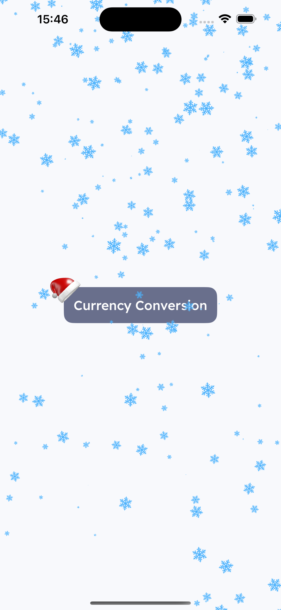
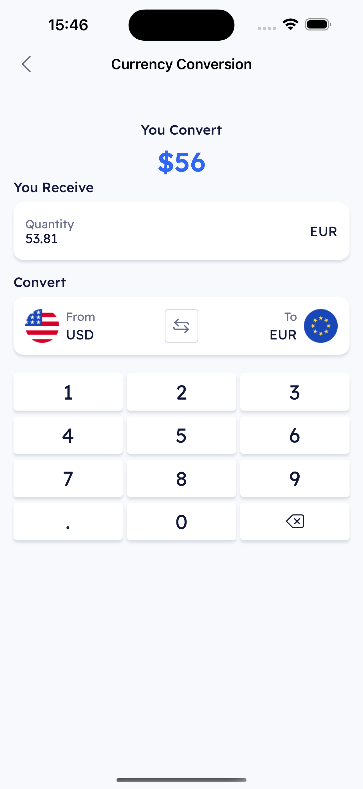

## How To Run
Clone the repository and build the project. No external dependencies are required.

## Project Details
* `iOS 15` - Minimum iOS version supported
* The project utilizes `UIImpactFeedbackGenerator` to enhance the user experience. For optimal testing, it is recommended to use a physical device.

## [Development Pipeline](https://www.atlassian.com/git/tutorials/comparing-workflows/gitflow-workflow)
There are two main branches: `main and development`, following Gitflow branching conventions.
* `development` - develop branch
* `main` - release branches

The overall flow is Gitflow:

* Schema: `development -> main`.

## [Design Reference](https://www.figma.com/design/OvTlQkYwuZp3pjuKKyLBGU/CryptoExchange-Mobile-App-FREE-(Community)?node-id=423-16231&t=BFamOO0oMyMdhkce-4)

The project includes a `XChangeIt App Design.fig` file, allowing you to open the design locally if the link is broken. (Screen 12 refers to the main app screen.), and file `Countries Flag Icons.fig` with all coutries flags [figma link](https://www.figma.com/design/3b9KVCprjufKmQk1Cd9BpS/Countries-Flag-icon-(%2B1000-ICON)-(Community)?m=auto&t=4dDbD2otAR6D3zfn-6). 

## Visual Representation Of The Project
For a better review of the UI, screenshots of the app screens have been provided via the link below. These files are also included in the project in case the link becomes unavailable. 

     

          
     

     

          
     

     

          
     

