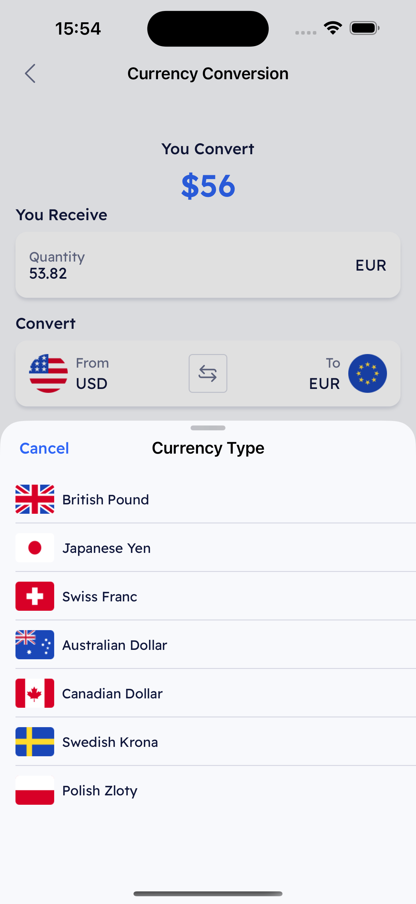

## About Project
#### **XChangeIt: Currency Conversion App**

**XChangeIt** is a simple mobile application that provides a currency conversion feature. The app allows users to exchange one currency for another, with real-time rates that dynamically update every 10 seconds. It is designed to demonstrate how to organize an app with horizontal scaling in mind, while also showcasing how to handle API failures with a mock implementation for testing.

---

#### **Key Features:**
- **Dynamic Currency Rates:**  
  The app connects to a public fake API to fetch real-time currency exchange rates, which are updated every 10 seconds to reflect the most current rates.

- **Currency Selection & Input:**  
  Users can select any currency from the available options and enter a value to convert. The selected currency’s rate will automatically update at regular intervals.

- **Mock API for Testing:**  
  During development you can create any mock in separate module for testing and any desired tests.

---

#### **Architecture Overview:**
**XChangeIt** is designed with horizontal scaling in mind, making it easier to expand or modify the app’s core functionality. Key design decisions include:

- **Modularization:**  
  The app is organized into distinct modules, each responsible for a specific task (e.g., API handling, currency selection, conversion logic, etc.). This structure makes it easy to add new features or change existing ones without affecting the entire app.

- **Localization:**  
  **XChangeIt** supports multiple languages, allowing users from different regions to use the app in their preferred language. The app’s core framework handles localization dynamically, making it scalable for additional languages in the future.

---

#### **How the App Works:**
1. **Currency Selection:**  
   Users choose a currency from a list of supported options.

2. **Enter Amount:**  
   Users input the amount they wish to convert.

3. **Exchange Rate Update:**  
   The app periodically fetches the latest exchange rate from the API, updating the user interface with the new rate every 10 seconds.

4. **API Failure Handling:**  
   In the event that the currency API is unavailable, the app automatically return corresponding error description.
   
---
   
#### **P.S.**
API for currency exchanging can be unavailable during examing as I am not the owner in this case you will see some error, in this case, create any mock to run the application and test, the mock example located in `XChangeItConvertCurrencyExample` project, or you can run directly this module with this already defined mock.

## How To Run
Clone the repository and build the project. No external dependencies are required.

## Project Details
* `iOS 15` - Minimum iOS version supported
* The project utilizes `UIImpactFeedbackGenerator` to enhance the user experience. For optimal testing, it is recommended to use a physical device.
* MVVM + Coordinator and modular arhitecture.
* `main` branch contains the last update.
* `development` branch development branch.
* `monolit-architecture` branch contains a non-modular example of this project for compassion.

## [Development Pipeline](https://www.atlassian.com/git/tutorials/comparing-workflows/gitflow-workflow)
There are two main branches: `main and development`, following Gitflow branching conventions.
* `development` - develop branch
* `main` - release branches

The overall flow is Gitflow:

* Schema: `development -> main`.

## [Design Reference](https://www.figma.com/design/OvTlQkYwuZp3pjuKKyLBGU/CryptoExchange-Mobile-App-FREE-(Community)?node-id=423-16231&t=BFamOO0oMyMdhkce-4)

The project includes a `XChangeIt App Design.fig` file, allowing you to open the design locally if the link is broken. (Screen 12 refers to the main app screen.), and file `Countries Flag Icons.fig` with all coutries flags [figma link](https://www.figma.com/design/3b9KVCprjufKmQk1Cd9BpS/Countries-Flag-icon-(%2B1000-ICON)-(Community)?m=auto&t=4dDbD2otAR6D3zfn-6). 

## Visual Representation Of The Project
For a representation of the app's UI, screenshots of the app screens are provided below. These files are included in the project folder `XChangeItAppScreenshots`. 

  
   
  

